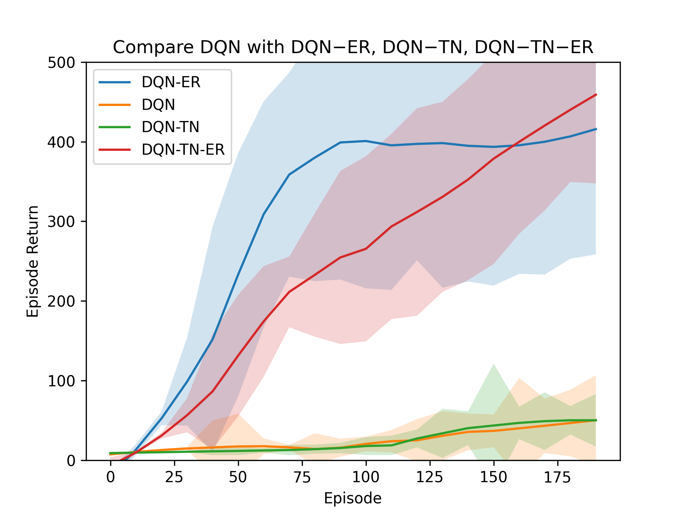
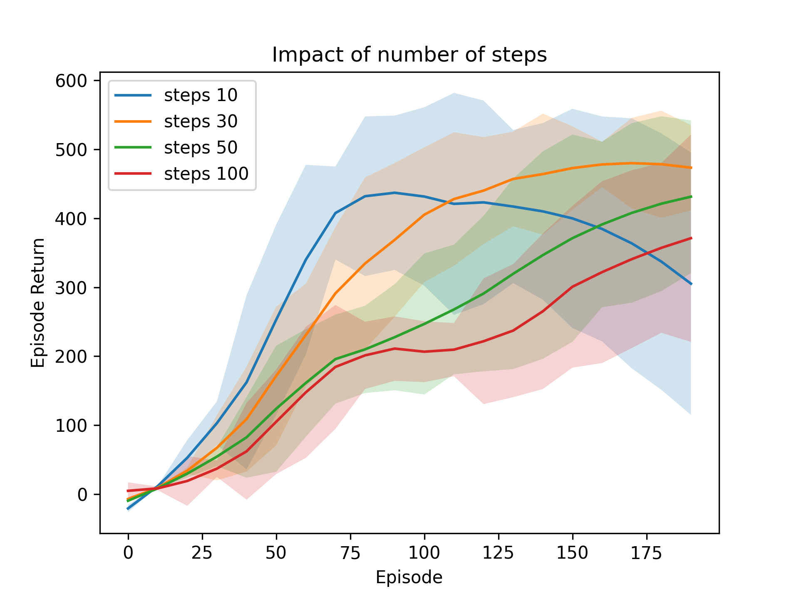

# CartPole

- [CartPole](#cartpole)
  - [How to run](#how-to-run)
    - [Options](#options)
    - [Example](#example)
  - [Comparing DQN, DQN-ER, DQN-TN, and DQN-ER-TN](#comparing-dqn-dqn-er-dqn-tn-and-dqn-er-tn)
    - [How to Run](#how-to-run-1)
    - [Results](#results)
  - [Experiment](#experiment)
    - [How to Run Experiments](#how-to-run-experiments)
    - [Experiment Results from Random Search](#experiment-results-from-random-search)
    - [Experiment Results from Grid Search](#experiment-results-from-grid-search)
      - [Number of Steps](#number-of-steps)
      - [Learning Rate](#learning-rate)
      - [Exploration Policies](#exploration-policies)

## How to run

- Install `python` if you don't already have it
- Install [miniconda](https://docs.anaconda.com/free/miniconda/miniconda-install/)
- Clone the project: `git clone git@github.com:NastaranMO/CartPole.git`
- Create a conda environement: `conda env create -f environment.yml`
- Activate the environment: `conda activate CartPole`
- Run the `AgentTrainer` the command below:

```bash
python AgentTrainer.py [--ER] [--TN] [--anneal] [--num_episodes NUM_EPISODES] [--eval_episodes EVAL_EPISODES] [--eval_interval EVAL_INTERVAL] [--num_repetitions NUM_REPETITIONS] [--lr LR] [--explr EXPLR] [--gamma GAMMA]
```

### Options

| Flag            | Environment Variable Name | Description                    | Default Value |
| --------------- | ------------------------- | ------------------------------ | ------------- |
| ER              |                           | Experience Replay              | True          |
| TN              |                           | Target Network                 | True          |
| anneal          |                           | annealing                      | False         |
| num_episodes    | NUM_EPISODES              | training episodes              | 200           |
| eval_episodes   | EVAL_EPISODES             | Evaluation episodes            | 20            |
| eval_interval   | EVAL_INTERVAL             | Evaluation Interval            | 10            |
| num_repetitions | NUM_REPETITIONS           | repetions                      | 20            |
| lr              | LR                        | learning rate                  | 1e-4          |
| explr           | EXPLR                     | Exploration Strategy           | egreedy 0.3   |
| gamma           | GAMMA                     | Discount Factor                | 1             |
| steps           |                           | steps to update target network | 50            |

### Example

```bash
python AgentTrainer.py --num_episodes=100 --steps=10 --lr=1e-3
```

## Comparing DQN, DQN-ER, DQN-TN, and DQN-ER-TN

### How to Run

- Run the command `python Comparing_algorithms.py`

### Results

The graph is averaged over 20 repetitions across 200 episodes with parameters below. You can also find the numpy array results of this in the folder [results](https://github.com/NastaranMO/CartPole/tree/main/results) and plot them yourself.

| Variable      | Value       |
| ------------- | ----------- |
| LEARNING_RATE | 1e-4        |
| NUM_STEPS     | 50          |
| GAMMA         | 1           |
| EXPLR         | egreedy 0.3 |
| BATCH_SIZE    | 32          |



## Experiment

### How to Run Experiments

We performed a greed and random search hyperparameter tuning with different settings for learning rate, exploration startegies, and number of steps. You can explore the result of the mentioned experiments by running the command below:

```bash
python Experiment.py
```

### Experiment Results from Random Search

| Variable        | Value                      |
| --------------- | -------------------------- |
| NUM_REPETITIONS | 5                          |
| NUM_EPISODES    | 200                        |
| EVAL_EPISODES   | 5                          |
| NUM_INTERVALS   | 10                         |
| LEARNING_RATE   | 1.3886531790755207e-5      |
| NUM_STEPS       | 49                         |
| GAMMA           | 1                          |
| EXPLR           | softmax 1.2576454147068064 |
| BATCH_SIZE      | 128                        |


### Experiment Results from Grid Search

The default values for following experiments are:

| Variable        | Value       |
| --------------- | ----------- |
| NUM_REPETITIONS | 20          |
| NUM_EPISODES    | 200         |
| EVAL_EPISODES   | 20          |
| NUM_INTERVALS   | 10          |
| LEARNING_RATE   | 1e-4        |
| NUM_STEPS       | 50          |
| GAMMA           | 1           |
| EXPLR           | egreedy 0.3 |
| BATCH_SIZE      | 32          |

#### Number of Steps



#### Learning Rate


#### Exploration Policies


